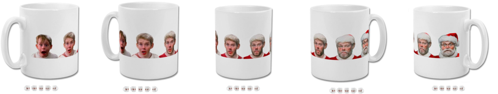
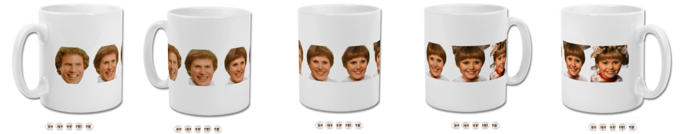

# StyleGANSecretSanta

Create a comic morphing one face to another using StyleGAN.

Choose from the preset images, or upload your own. 

It works quite well to use a Christmas character (like Buddy from Elf),
and a picture of your Secret Santa recipient!

If you like the result, pay £6 to get it wrapped around a mug.
Check out some of the examples below :)

### Instructions

For a full tutorial see the Colab notebook. (https://colab.research.google.com/drive/1PfI_evHrzCXdPDKm1A5gQDy8xmUTbSrC?usp=sharing)

### Examples

##### Kevin + Santa

##### Buddy + Cindy

